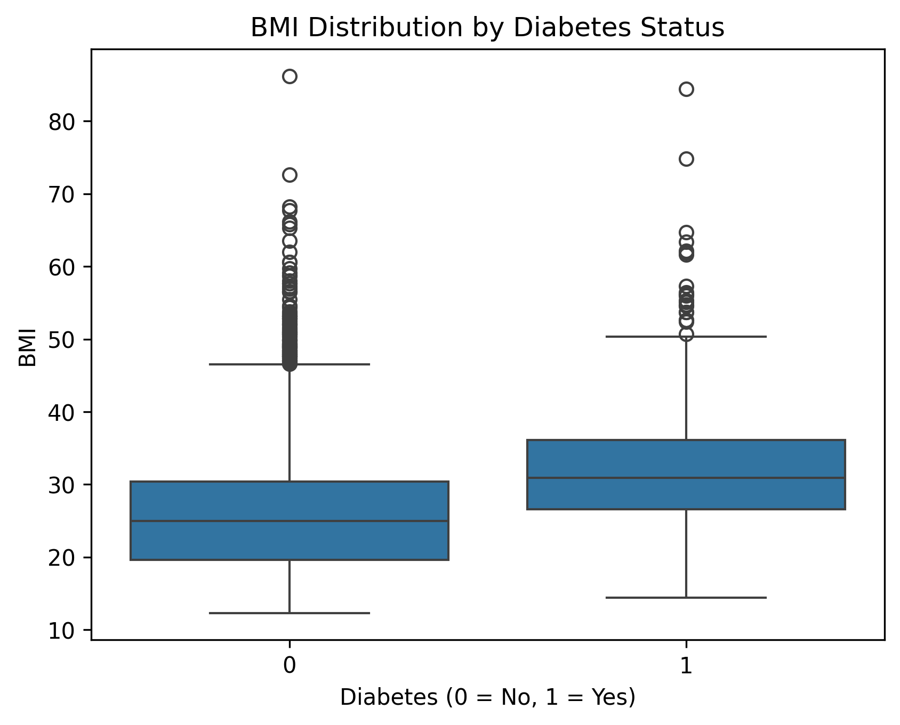
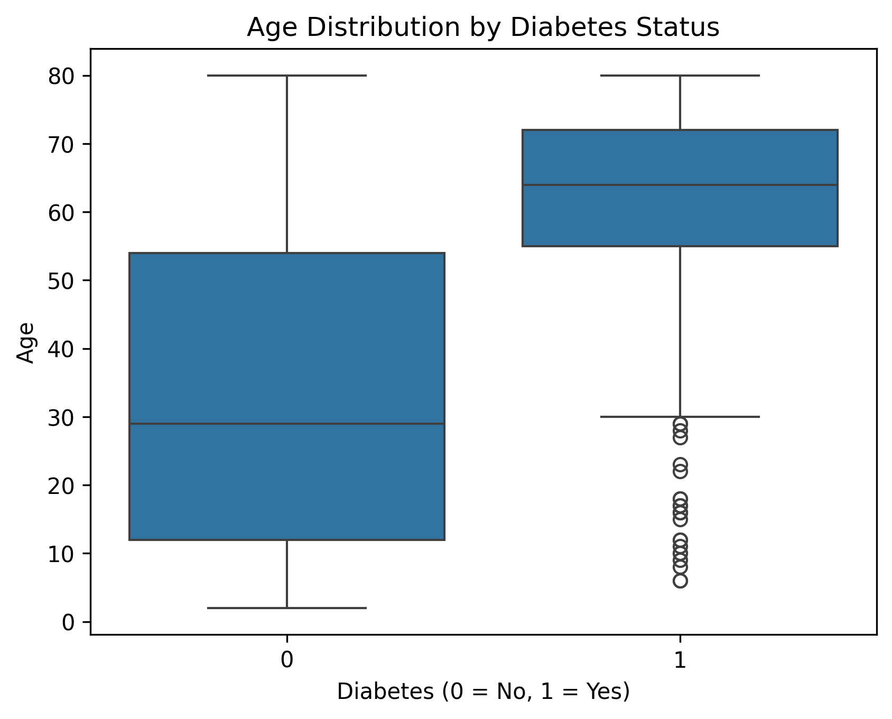

# Diabetes Risk Analysis (NHANES)

## Project Overview

This project analyzes the relationship between demographic and clinical factors and diabetes using data from the National Health and Nutrition Examination Survey (NHANES).

The goal is to identify key risk factors associated with diabetes through statistical analysis and logistic regression.

---

## Dataset

The data comes from NHANES 2017–2018 and includes multiple modules:

- Demographics
- Diabetes questionnaire
- Body measurements (BMI)
- Smoking behavior

Datasets were merged using the participant identifier `SEQN`.

---

## Variables Used

The analysis focuses on the following variables:

- **Age**
- **Sex**
- **Body Mass Index (BMI)**
- **Smoking status**
- **Diabetes diagnosis**

These variables were selected based on their known clinical relevance in epidemiology.

---

## Methods

The analysis includes:

1. Data loading and merging
2. Data cleaning and preprocessing
3. Exploratory Data Analysis (EDA)
4. Logistic regression modeling
5. Interpretation of odds ratios

---

## Key Findings

- **Age** is strongly associated with diabetes  
- **BMI** is a major predictor of diabetes risk  
- **Sex** shows a significant association  
- **Smoking** was not statistically significant after adjustment  

---

## Example Visualizations

### BMI vs Diabetes

### Age vs Diabetes

---

## Model

A logistic regression model was used:

# Diabetes Risk Analysis (NHANES)

## Project Overview

This project analyzes the relationship between demographic and clinical factors and diabetes using data from the National Health and Nutrition Examination Survey (NHANES).

The goal is to identify key risk factors associated with diabetes through statistical analysis and logistic regression.

---

## Dataset

The data comes from NHANES 2017–2018 and includes multiple modules:

- Demographics
- Diabetes questionnaire
- Body measurements (BMI)
- Smoking behavior

Datasets were merged using the participant identifier `SEQN`.

---

## Variables Used

The analysis focuses on the following variables:

- **Age**
- **Sex**
- **Body Mass Index (BMI)**
- **Smoking status**
- **Diabetes diagnosis**

These variables were selected based on their known clinical relevance in epidemiology.

---

## Methods

The analysis includes:

1. Data loading and merging
2. Data cleaning and preprocessing
3. Exploratory Data Analysis (EDA)
4. Logistic regression modeling
5. Interpretation of odds ratios

---

## Key Findings

- **Age** is strongly associated with diabetes  
- **BMI** is a major predictor of diabetes risk  
- **Sex** shows a significant association  
- **Smoking** was not statistically significant after adjustment  

---

## Example Visualizations

### BMI vs Diabetes

### Age vs Diabetes

---

## Model

A logistic regression model was used:
logit(P(diabetes)) = β0 + β1·age + β2·bmi + β3·sex + β4·smoking

Odds ratios were calculated to interpret the effect of each variable.

---

## Technologies Used

- Python
- pandas
- numpy
- matplotlib
- seaborn
- statsmodels
- Jupyter Notebook

---

## Project Structure

Odds ratios were calculated to interpret the effect of each variable.

---

## Technologies Used

- Python
- pandas
- numpy
- matplotlib
- seaborn
- statsmodels
- Jupyter Notebook

---

## Project Structure
diabetes-risk-analysis
│
├── data/
├── figures/
├── notebooks/
│ └── diabetes_analysis.ipynb
├── results/
└── README.md
